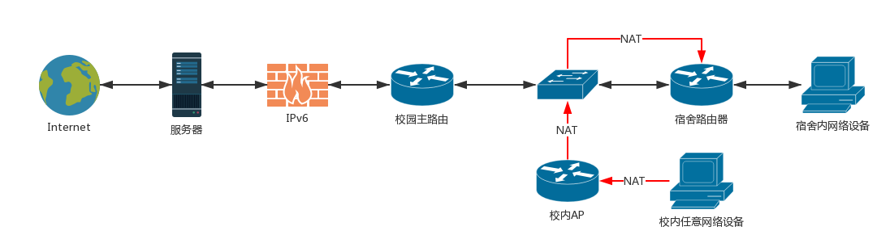

# 119Drive in BNU

* 网络拓扑是这样的：
  

* 使用校内内网穿透实现，目前使用 0.16.1 版本。师弟的虚拟机，恕不提供端口。

* 本项目有效期至2018年10月（不过早就滚蛋了），需要连接BNU-Mobile才能使用免流，配合Proxifier（Mac / Win都有）、小火箭或者土豆丝（手机端）使用。

  

* 实际上不能使用某方法达到完全混淆的效果，但是可以实现部分（如：浏览网页文字、部分图片）的免流。不妨是最后的挣扎策略